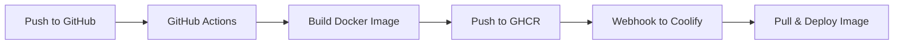

# Updating Django/Wagtail from Coolify

This guide explains how to update your Django/Wagtail application deployed on Coolify, including running migrations, managing static files, and handling rollbacks.

## Table of Contents
1. [Deployment Workflows](#deployment-workflows)
2. [Running Migrations](#running-migrations)
3. [Managing Static Files](#managing-static-files)
4. [Creating Superuser](#creating-superuser)
5. [Rollback Procedures](#rollback-procedures)
6. [Troubleshooting](#troubleshooting)

## Deployment Workflows

### Flow A: GHCR Image Workflow (Recommended)

This workflow uses pre-built Docker images from GitHub Container Registry.



**Setup:**

1. **Configure GitHub Actions** (already in `.github/workflows/docker.yml`)
2. **Add Coolify Webhook to GitHub Secrets**:
   - Go to GitHub repo → Settings → Secrets → Actions
   - Add `COOLIFY_WEBHOOK_URL` with value from Coolify

3. **Configure Coolify to use GHCR**:
   ```yaml
   Image: ghcr.io/mdsniper/benniewilliams-wagtail:latest
   Registry: ghcr.io
   Username: <github-username>
   Password: <github-pat-with-read:packages>
   ```

4. **Deployment Process**:
   - Push code to `main` branch
   - GitHub Actions builds and pushes image
   - Coolify receives webhook and pulls new image
   - Container restarts with new code

### Flow B: Git Repository Build Workflow

This workflow builds the Docker image directly on Coolify from the Git repository.

**Setup:**

1. **Configure Coolify Source**:
   ```yaml
   Repository: https://github.com/MDsniper/BennieWilliams-Wagtail
   Branch: main
   Build Pack: Dockerfile
   ```

2. **Set Build Arguments** (if needed):
   ```yaml
   BUILDARGS:
     - PYTHON_VERSION=3.12
   ```

3. **Deployment Process**:
   - Push code to repository
   - Trigger deployment in Coolify (manual or webhook)
   - Coolify clones repo and builds image
   - Container restarts with new build

## Running Migrations

Migrations are automatically run by the `entrypoint.sh` script on container startup. To run them manually:

### Via Coolify Terminal

1. Open Coolify dashboard
2. Navigate to your application
3. Click "Terminal" or "Execute Command"
4. Run:
```bash
python manage.py migrate
```

### Via SSH to Server

```bash
# Find container name
docker ps | grep bennie

# Execute migration
docker exec -it <container-name> python manage.py migrate

# Check migration status
docker exec -it <container-name> python manage.py showmigrations
```

### Skipping Automatic Migrations

Set environment variable in Coolify:
```env
DJANGO_SKIP_MIGRATIONS=1
```

## Managing Static Files

Static files are collected automatically on startup. To manually collect:

### Via Coolify

```bash
python manage.py collectstatic --noinput
```

### Via Docker

```bash
docker exec -it <container-name> python manage.py collectstatic --noinput
```

### Persistent Static Files

Ensure volume is mounted in Coolify:
```yaml
Volumes:
  - static_data:/app/staticfiles
  - media_data:/app/media
```

## Creating Superuser

### Method 1: Environment Variables (Automatic)

Set in Coolify environment:
```env
DJANGO_SUPERUSER_USERNAME=admin
DJANGO_SUPERUSER_EMAIL=admin@example.com
DJANGO_SUPERUSER_PASSWORD=secure-password-here
```

The user is created automatically on first startup.

### Method 2: Manual Creation

Via Coolify terminal:
```bash
python manage.py createsuperuser
```

### Method 3: Django Shell

```bash
python manage.py shell
```

```python
from django.contrib.auth import get_user_model
User = get_user_model()
User.objects.create_superuser('admin', 'admin@example.com', 'password')
```

## Rollback Procedures

### Quick Rollback (GHCR Workflow)

1. **In Coolify**, change image tag:
   ```yaml
   # From:
   Image: ghcr.io/mdsniper/benniewilliams-wagtail:latest

   # To previous version:
   Image: ghcr.io/mdsniper/benniewilliams-wagtail:v1.2.3
   ```

2. **Redeploy** in Coolify

### Database Rollback

1. **Before deploying**, create backup:
```bash
docker exec <container> pg_dump -U postgres postgres > backup-$(date +%Y%m%d).sql
```

2. **If rollback needed**:
```bash
# Stop application
docker stop <app-container>

# Restore database
docker exec -i <db-container> psql -U postgres postgres < backup-20240115.sql

# Rollback migrations if needed
docker exec <app-container> python manage.py migrate <app_name> <migration_name>

# Start application
docker start <app-container>
```

### Git Repository Rollback

1. **In Coolify**, change branch or commit:
   ```yaml
   Branch: main
   # or
   Commit: abc123def456
   ```

2. **Rebuild and deploy**

## Troubleshooting

### Application Won't Start

Check logs in Coolify:
```bash
# View last 100 lines
docker logs --tail 100 <container-name>

# Follow logs
docker logs -f <container-name>
```

### Database Connection Issues

1. **Verify DATABASE_URL**:
```bash
docker exec <container> printenv DATABASE_URL
```

2. **Test connection**:
```bash
docker exec <container> python manage.py dbshell
```

### Static Files Not Loading

1. **Check WhiteNoise configuration**:
```python
# In settings.py
MIDDLEWARE = [
    'django.middleware.security.SecurityMiddleware',
    'whitenoise.middleware.WhiteNoiseMiddleware',  # Should be here
    ...
]
```

2. **Verify static files collected**:
```bash
docker exec <container> ls -la /app/staticfiles/
```

3. **Check static URL configuration**:
```bash
docker exec <container> python manage.py shell -c "from django.conf import settings; print(settings.STATIC_URL)"
```

### Memory Issues

Monitor container resources:
```bash
docker stats <container-name>
```

Adjust in Coolify:
```yaml
Resources:
  Memory: 1024  # MB
  CPU: 1.0      # cores
```

### Migration Conflicts

1. **List migrations**:
```bash
docker exec <container> python manage.py showmigrations
```

2. **Fake migration if needed**:
```bash
docker exec <container> python manage.py migrate --fake <app> <migration>
```

3. **Reset migrations** (dangerous in production):
```bash
docker exec <container> python manage.py migrate <app> zero
```

## Health Checks

### Configure in Coolify

```yaml
Health Check:
  Path: /admin/login/
  Interval: 30s
  Timeout: 10s
  Retries: 3
```

### Custom Health Check Endpoint

Add to `urls.py`:
```python
from django.http import JsonResponse

def health_check(request):
    return JsonResponse({"status": "healthy"})

urlpatterns = [
    path('health/', health_check),
    ...
]
```

## Monitoring

### Application Logs
```bash
# Django logs
docker exec <container> tail -f /app/logs/django.log

# Gunicorn access logs
docker exec <container> tail -f /app/logs/access.log
```

### Database Queries
```python
# Enable query logging in settings.py (dev only)
LOGGING = {
    'version': 1,
    'handlers': {
        'console': {
            'class': 'logging.StreamHandler',
        },
    },
    'loggers': {
        'django.db.backends': {
            'handlers': ['console'],
            'level': 'DEBUG',
        },
    },
}
```

## Best Practices

1. **Always backup before major updates**
2. **Test migrations locally first**
3. **Use staging environment when possible**
4. **Monitor application after deployment**
5. **Keep environment variables in Coolify, not in code**
6. **Use health checks to detect issues early**
7. **Set up alerts for deployment failures**

## Emergency Recovery

If the application is completely broken:

1. **Stop the container** in Coolify
2. **Restore from backup** (database and media files)
3. **Deploy previous working version**
4. **Investigate issues in staging environment**
5. **Fix and test thoroughly before redeploying**

## Support

For Coolify-specific issues:
- Coolify Documentation: https://coolify.io/docs
- Coolify Discord: https://discord.gg/coolify

For application issues:
- Check application logs
- Review Django debug toolbar (if enabled)
- Contact: bennie@benniewilliams.com